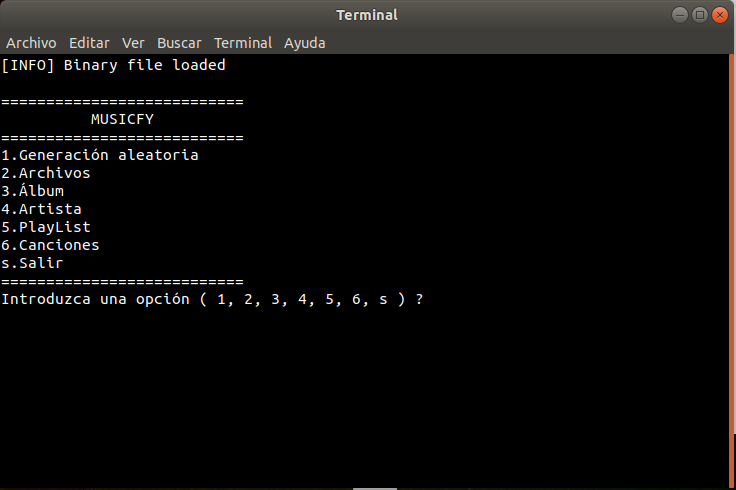
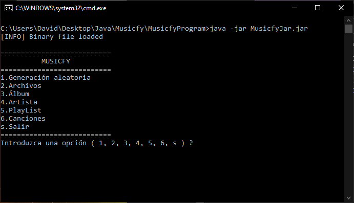

# Musicfy
 Musicfy pretends to emulate an application to manage a data base from a music reproduction via "streaming" company.
 Its a very simple terminal application that shows several menus to manage this data base.
 (For more information click [here](Practica_Final_19_20.pdf))
 
GNU/Linux:




Windows:




## Usage
**Necessary Java JDK 12 or more to execute.**

### Usage option list
- Execute proyect in Netbeans IDE by downloading **"MusicfyProyect" folder**

- Execute from jar. You need to have **MusicfyData folder** in the same directory as the jar. To execute the jar you can just double clic the   executable files provided in **MusicfyProgram folder** or type it in the terminal:
```sh
      $ java -jar MusicfyJar.jar
```
